# HOL 02 — Deploying a Hybrid Infrastructure for Researchers in AWS

**Student:** Iñigo Arriazu  
**Email:** inigo.arriazu@estudiants.urv.cat  
**Date:** June 3, 2026  
**Course:** High Performance and Distributed Computing

---

## Step 1: Create VPC and Public Subnet

Created a VPC named `lab-vpc` with CIDR `10.0.0.0/16` and a public subnet named `lab-public-subnet` with CIDR `10.0.1.0/24`. Auto-assign public IP was enabled on the subnet.

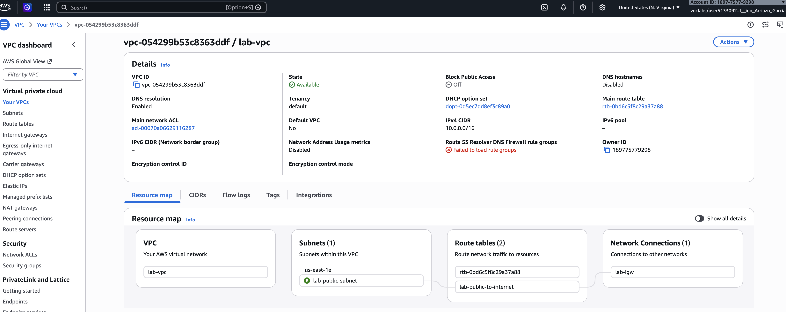

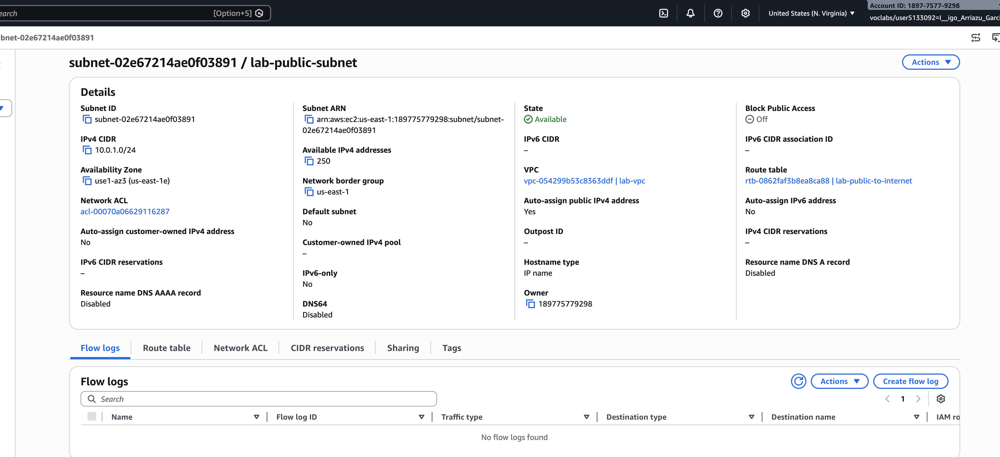

---

## Step 2: Create and Attach Internet Gateway

Created an Internet Gateway named `lab-igw` and attached it to `lab-vpc`. This allows traffic between the VPC and the internet.

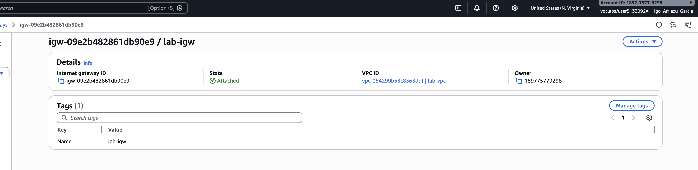

---

## Step 3: Create Route Table

Created a route table named `lab-public-to-internet`, added a route for `0.0.0.0/0` pointing to `lab-igw`, and associated it with `lab-public-subnet`.

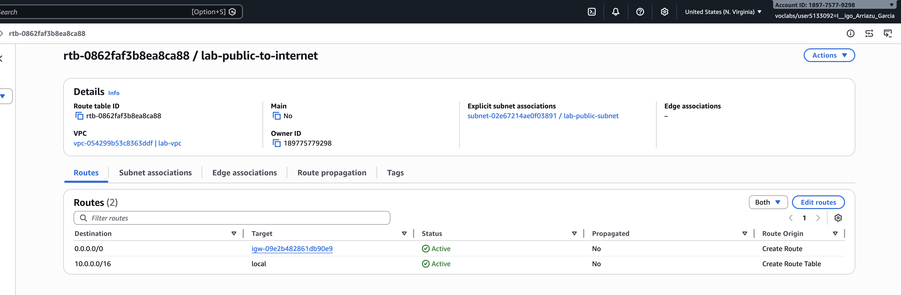

---

## Step 4: Launch EC2 Instance

Launched a `t2.micro` EC2 instance named `lab-public-ec2` in the public subnet with Amazon Linux 2023. Configured a security group (`lab-sg`) allowing inbound traffic on port 22 (SSH) and port 8888 (Jupyter Notebook).

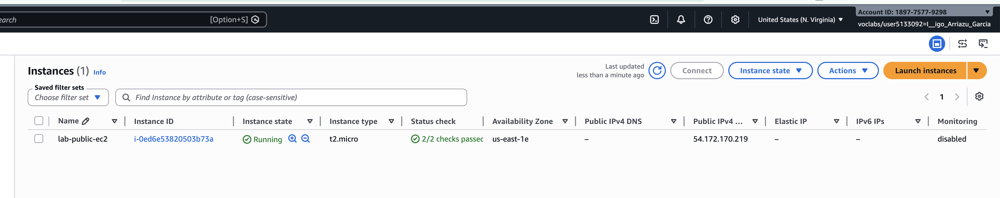

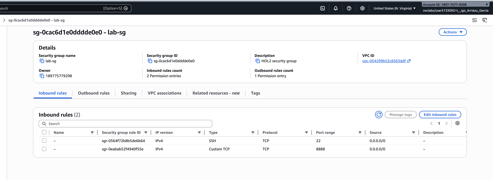

---

## Step 5: SSH and Install Software

Connected to the EC2 instance via SSH and installed `boto3`, `jupyter`, and `pillow`.

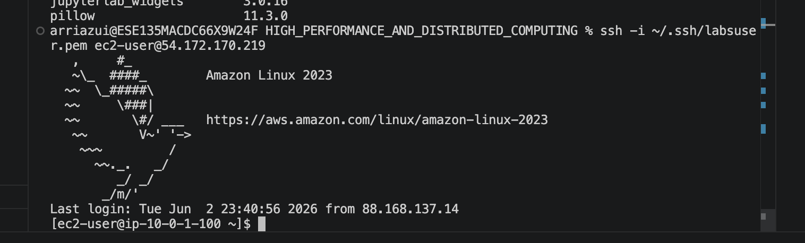

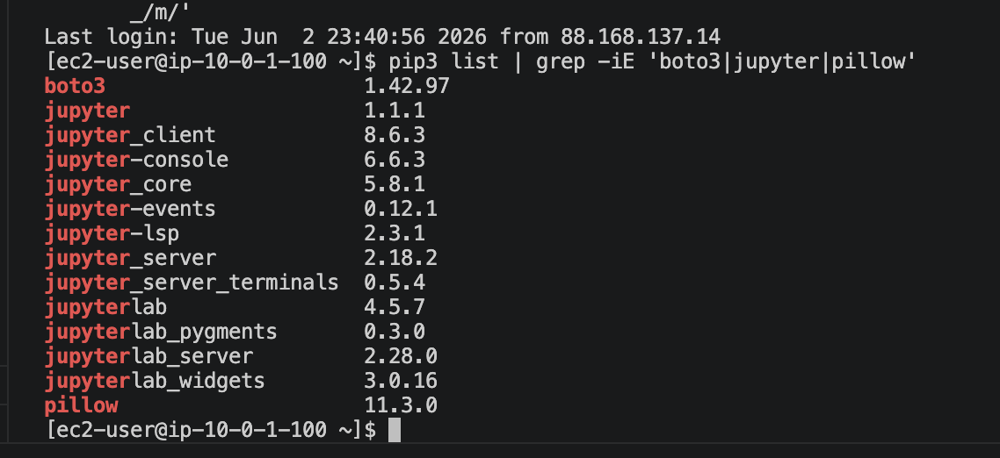

---

## Step 6: Create S3 Buckets and Lambda Function

### 6a. S3 Buckets

Created two S3 buckets:
- `lab-input-bucket-arriazu` (receives images from Jupyter)
- `lab-output-bucket-arriazu` (receives processed images from Lambda)

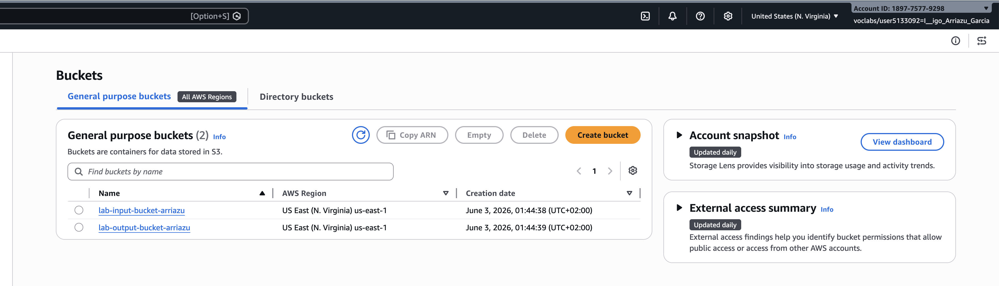

### 6b. Lambda Function

Created a Lambda function named `lab-lambda-function` with Python 3.12 runtime. The function downloads an image from the input bucket, renames it with a `-processed` suffix, and uploads it to the output bucket.

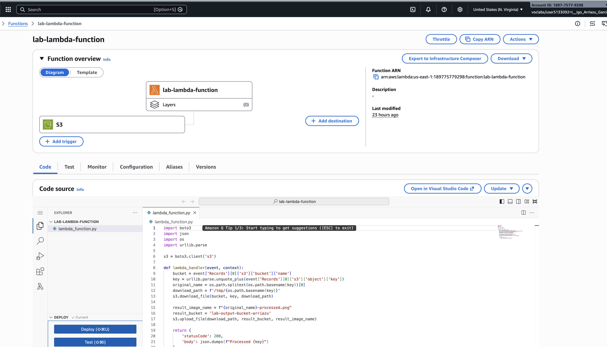

### 6c. S3 Trigger

Configured the input bucket to trigger the Lambda function on every new object creation (`s3:ObjectCreated:*`).

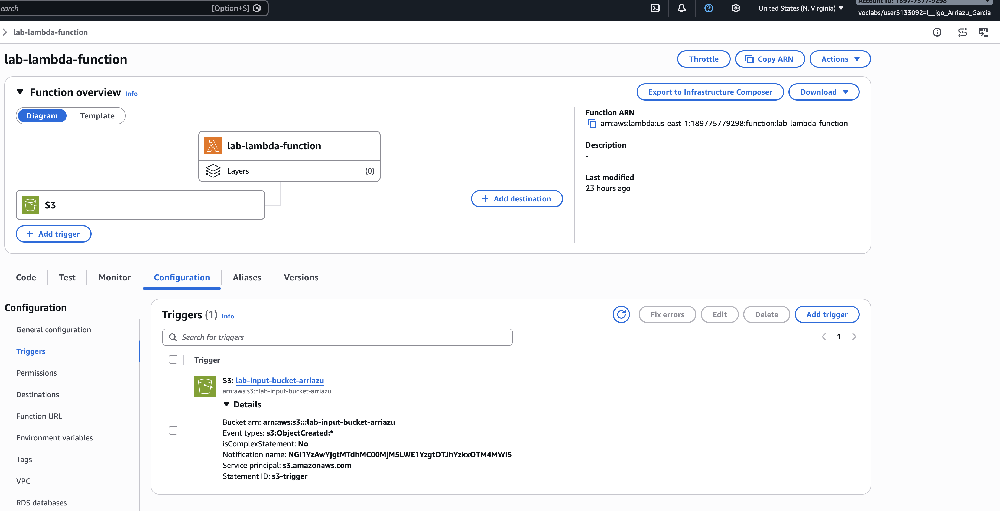

---

## Step 7: Launch Jupyter and Run Code

### 7a. AWS Credentials on EC2

Configured AWS CLI credentials on the EC2 instance by pasting the session credentials from AWS Academy into `~/.aws/credentials`.

### 7b. Jupyter Notebook Server

Launched Jupyter Notebook on port 8888 and accessed it via the browser at `http://54.160.117.52:8888`.


### 7c. Run the Upload Code

Ran the provided Python code in Jupyter to create an example image and upload it to the input S3 bucket.

```python
from PIL import Image, ImageDraw
import boto3
import io

image = Image.new('RGB', (200, 100), color='white')
draw = ImageDraw.Draw(image)
draw.text((50, 40), "Hello!", fill='black')
buffer = io.BytesIO()
image.save(buffer, format='PNG')
buffer.seek(0)

bucket_name = 'lab-input-bucket-arriazu'
s3 = boto3.client('s3')
object_key = 'lab-image.png'
s3.upload_fileobj(buffer, bucket_name, object_key)
print(f"Image uploaded to s3://{bucket_name}/{object_key}")
```

**Output:** `Image uploaded to s3://lab-input-bucket-arriazu/lab-image.png`

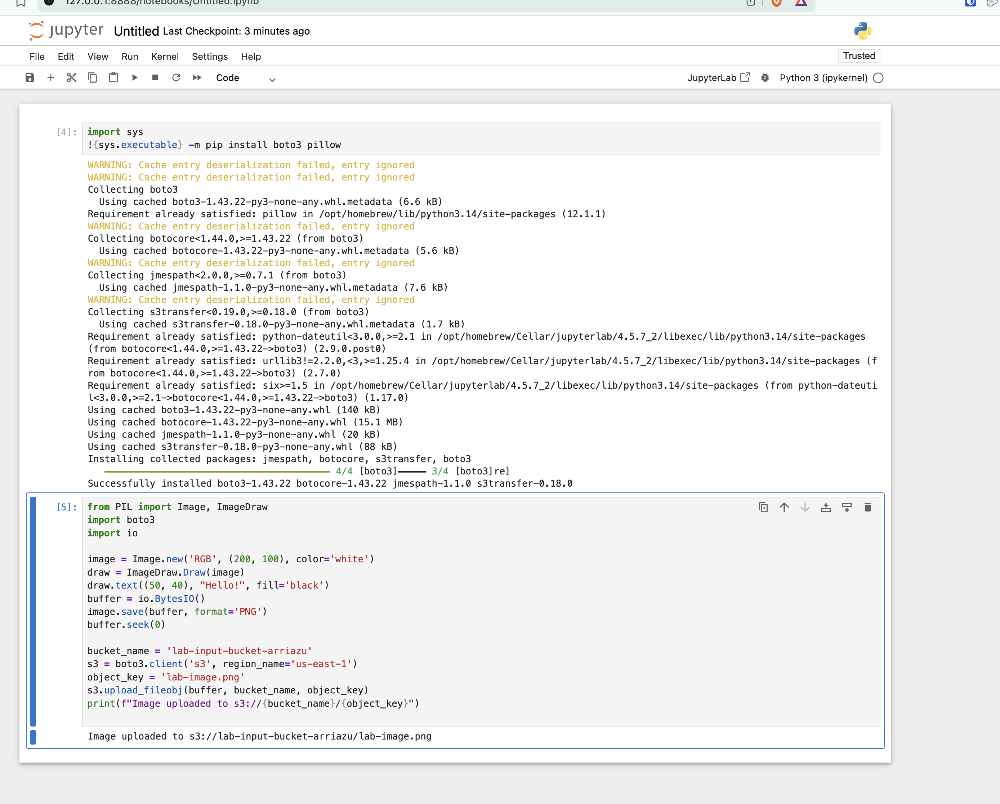

---

## Step 8: Verify Lambda Processing

Checked the output bucket and confirmed that `lab-image-processed.png` was created by the Lambda function.

```
2026-06-03 01:48:15   684 lab-image-processed.png
```

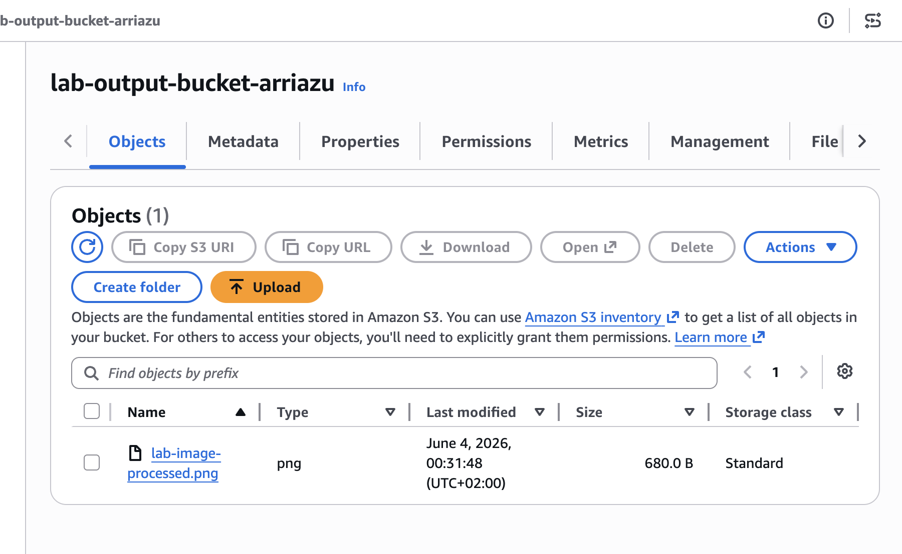

---

## Summary

| Resource | Name | ID |
|----------|------|----|
| VPC | `lab-vpc` | `vpc-054299b53c8363ddf` |
| Subnet | `lab-public-subnet` | `subnet-02e67214ae0f03891` |
| Internet Gateway | `lab-igw` | `igw-09e2b482861db90e9` |
| Route Table | `lab-public-to-internet` | `rtb-0862faf3b8ea8ca88` |
| Security Group | `lab-sg` | `sg-0cac6d1e0dddde0e0` |
| EC2 Instance | `lab-public-ec2` | `i-0ed6e53820503b73a` |
| S3 Input Bucket | `lab-input-bucket-arriazu` | — |
| S3 Output Bucket | `lab-output-bucket-arriazu` | — |
| Lambda Function | `lab-lambda-function` | — |

The complete pipeline works: Jupyter uploads an image to the input bucket → S3 triggers the Lambda → Lambda processes the image and saves it to the output bucket.
